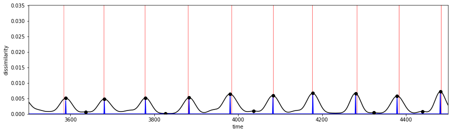

# PyTorch implementation of TIRE
[](https://opensource.org/licenses/BSD-3-Clause)

**TIRE** is an autoencoder-based change point detection algorithm for time series data that uses a TIme-Invariant Representation (TIRE). More information can be found in the 2020 preprint *Change Point Detection in Time Series Data using Autoencoders with a Time-Invariant Representation*. 

## Usage

```python
from TIRE import TIRE
import torch
import numpy as np

device = torch.device('cuda' if torch.cuda.is_available() else 'cpu')
model = TIRE().to(device)

seq_length = 4500
dim = 1
ts = np.random.randn(seq_length, )

model.fit(ts)

dissimilarities, change_point_scores = model.predict(ts)

# plt.plot(dissimilarities)
```




## Installation
```
pip install git+https://github.com/HolyBayes/TIRE_pytorch
```

## Authors


    @misc{ryck2020change,
    title={Change Point Detection in Time Series Data using Autoencoders with a Time-Invariant Representation},
    author={Tim De Ryck and Maarten De Vos and Alexander Bertrand},
    year={2020},
    eprint={2008.09524},
    archivePrefix={arXiv},
    primaryClass={cs.LG}}

## Contacts

Artem Ryzhikov, LAMBDA laboratory, Higher School of Economics, Yandex School of Data Analysis

**E-mail:** artemryzhikoff@yandex.ru

**Linkedin:** https://www.linkedin.com/in/artem-ryzhikov-2b6308103/

**Link:** https://www.hse.ru/org/persons/190912317
